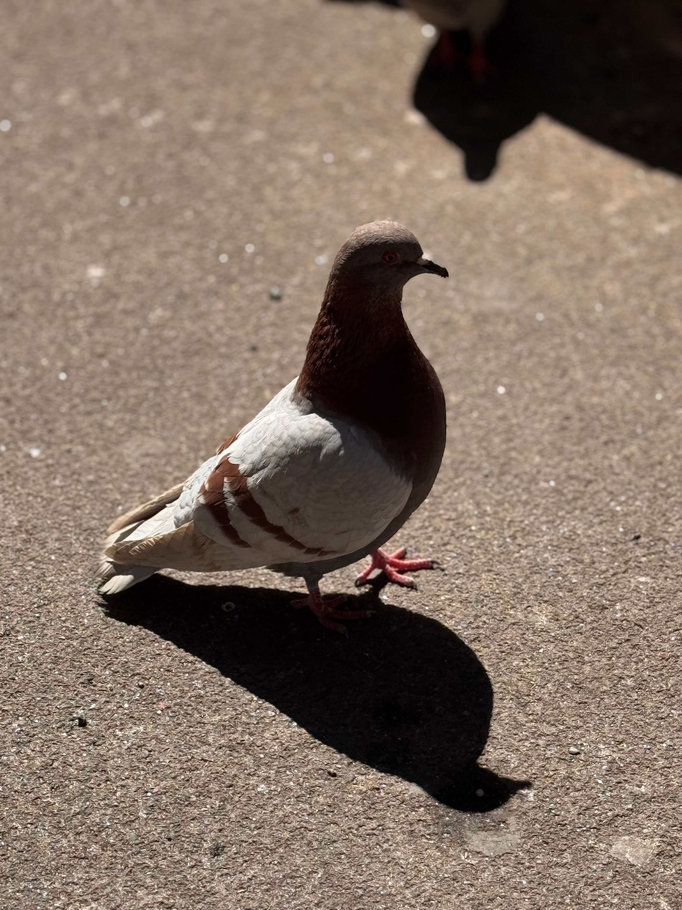

## about this site
after creating https://github.com/arionalmond/minSite,  
I wanted to use a jekyll theme for a very minimal github pages site.  

Below is me testing similar site content but with  
[the minimal github pages jekyll theme](https://github.com/pages-themes/minimal)  

# H1
## H2
### H3

[page 2 html](./page2.html).  
[page 2 html](./pg2.md).  

**bold text**  
*italicized text*  

`this is some code`  
to create a link: `[title](https://www.example.com)`  
[my github profile](https://github.com/arionalmond)  
[html page2](page2.html)  
[markdown page2](pg2.md)  
  
to add a sized picture: ``  
if your Markdown processor supports HTML (github does apparently)  
  
to add a picture: ``  
  

most of these above eamples came from [markdownguide](https://www.markdownguide.org)  

